# Goal

This project is a 2-board evil twin mixed with deauther, SAE-Overflow WPA3 attack and Wardriving. 

It's based on:
- ESP32-C5-WROOM-1-N8R4 / ESP32-C5-WROOM-1U-N8R4 (main CLI steering, deauth and password verification)
- ESP32 (optional, needed only for evil twin captive portal)

It provides CLI and a Flipper Zero app running captive portal and password verification.

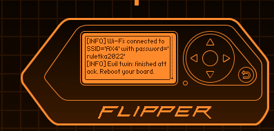

# Features

## Deauthentication attack

Deauthenticates more than one network, including 5GHz on very high channels. Uses PH country code.

## Evil Twin
On top of deauthentication, it offers an evil twin. Another ESP32 sets up a fake network having the same name as the original one where a captive portal asks for a password.

ESP32C5 passes twin network name to ESP32 over ESP-NOW. The collected password is passed back to C5 for verification. 
If verification is succesful, the deauth attack is stopped.

On iPhone, the Twin network should look like below. Note that an invisible character has been added to the network name to avoid grouping.


In CLI mode, a successful attack should look like below. Note that deauth stops as soon as the password is verified.


## WPA3 SAE Overflow attack. 
It floods exactly one router with SAE Commit Frames. The router cannot accept so many random MACs and fails to accept any new legitimate connections. 

It sends multiple SAE Commit frames with random MAC to a router. This does not affect existing connections, but stops new ones from being established - see connection failed below: 


Important: select exactly one target before running this attack.

Wireshark reveals that the AP responds that it cannot handle so many stations:
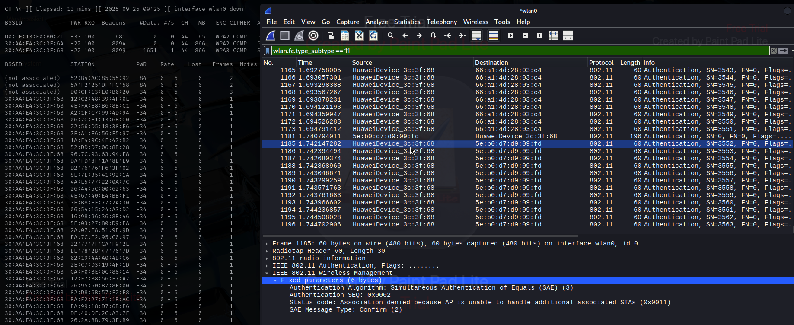

## Wardriving

Creates files in Wigle.net format on SD card attached to the C5 board. Waits for GPS fix prior to actual wardriving.


## Sniffer

Sniffer is able to passively listen for traffic between AP and Clients. After you interrupt it, you can see list of all APs having clients, their count and MACs.

Additionally you can inspect probe requests captured during the scan.


# CLI Usage
The board, when connected to USB, offers a CLI interface. 
The CLI supports up/down arrows and TAB autocompletion. 

## Deauth

Typical usage for deauth attack would be:

scan_networks

select_networks 1 4

start_deauth

Please note that the order of selected networks is important. While all of them will be deauthed, the first one will additionally give its name to an evil twin.

## Evil Twin

Evil Twin workflow in CLI 

First, find all the networks around:

> scan_networks

Starting background WiFi scan...

Background scan started. Wait approx 15s..

> WiFi scan completed. Found 21 networks, status: 0

Retrieved 21 network records

"1","AX3_2.4","30:AA:E4:3C:3F:64","1","WPA2/WPA3 Mixed","-59","2.4GHz"

"2","","30:AA:E4:3C:3F:69","1","WPA2","-60","2.4GHz"

...

Scan results printed.


Next, decide which networks would be attacked. You can provide many indexes (space separated).

The first index will be not only deauthed, but will also give its name to the Evil twin network. 

> select_networks 1 2

Selected Networks:

AX3_2.4, 30:aa:e4:3c:3f:64, Ch1, WPA2/WPA3 Mixed

, 30:aa:e4:3c:3f:69, Ch1, WPA2


Next, verify what html files are present on SD card:

> list_sd

SD card mounted successfully

[...]

HTML files found on SD card:

1 1EXA~145.HTM

Here we have only one file, now we need to select it by providing its index:

> select_html 1

Loaded HTML file: 1EXA~145.HTM (1668 bytes)

Portal will now use this custom HTML.

Now, we're ready to start the attack:

> start_evil_twin

Starting captive portal for Evil Twin attack on: AX3_2.4

Captive portal started successfully

Attacking 2 network(s):

Target BSSID[0]: AX3_2.4, BSSID: 30:AA:E4:3C:3F:64, Channel: 1

Target BSSID[1]: , BSSID: 30:AA:E4:3C:3F:69, Channel: 1

Deauth attack started. Use 'stop' to stop.

All entered credentials will be stored in EVILTWIN.TXT file on SD card.

## SAE Overflow
After scan, first run select_networks with only one index:

select_networks 1

Next, run: 

sae_overflow

## Sniffer

First, start sniffing process for as long as you wish:

start_sniffer

next, terminate it with stop:

stop


Now, you can see Networks and their associated clients:

show_sniffer_results

Alternatively you can see probe requests:

show_probes


## Blackout

Just run: start_blackout

## Wardrive

Just run: start_wardrive

First you need to patiently wait for gps fix to be obtained! Only then wardrive will start and networks would be started.


## Portal

verify what html files are present on SD card:

> list_sd

SD card mounted successfully

[...]

HTML files found on SD card:

1 1EXA~145.HTM

Here we have only one file, now we need to select it by providing its index:

> select_html 1

Loaded HTML file: 1EXA~145.HTM (1668 bytes)

Portal will now use this custom HTML.

Now, we're ready to start the attack:

start_portal MySSID

Network named MySSID will be created. All entered credentials will be stored in PORTAL.TXT file on SD card.


# Flipper application screens and user journey
Run the app:

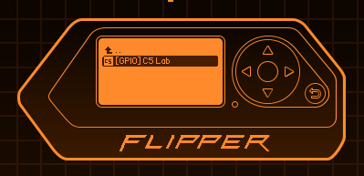

After running the app, connect the board when you see the splash screen.

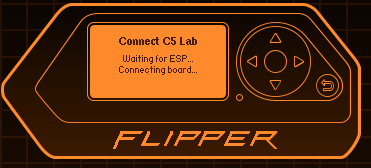

Run scan:


After clicking 'back' twice, go to Targets and select your target networks (the first one becomes the evil twin). Even though 'Confirm targets' gets selected after every click on each network, you can press the 'Up' button and select more networks.

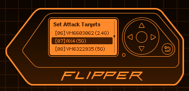

After selecting a network (remember: you can select more than one) you need to confirm your selection:

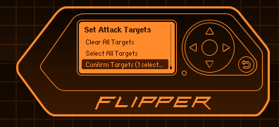

Once the selection is confirmed, select Deauth (or Evil Twin if you have paired an additional ESP32):


This is how running deauth looks like:


And this is how the flipper presents the password obtained from the Evil Twin portal:


The wardrive attack produces files in Wigle.net format and waits for a GPS fix before starting:


The SAE Overflow attacks only one selected network. Remember, you should have confirmed exactly one selected target:

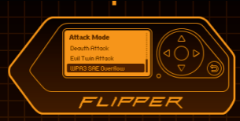


Sniffer menu. First, select Sniff Pockets option. 

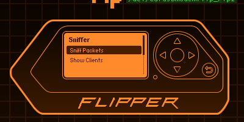


You will see how number of sniffed pockets increases. The longer you leave it on, the more clients will sniff. 

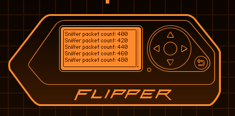

When you run Show Clients you can see report for each client:

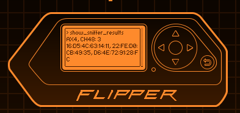

Finally when you run Show Probes you can see report of probe requests:

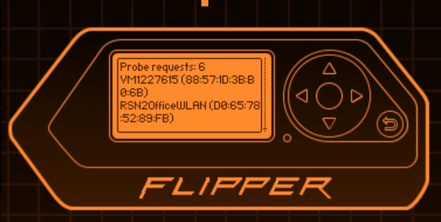

Select portal option presents portals found on the SD card:

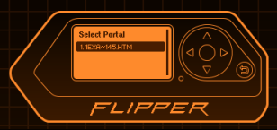


## Flashing ESP32-C5 Board

To flash the ESP32-C5 board, follow these steps:

1. Navigate to the `binaries-esp32c5` folder.
2. Launch the flashing script using the command below in your terminal:

   ```
   python flash_board.py
   ```

Watch the video below for a step-by-step guide:

[](Gfx/LABC5-flash.mp4)