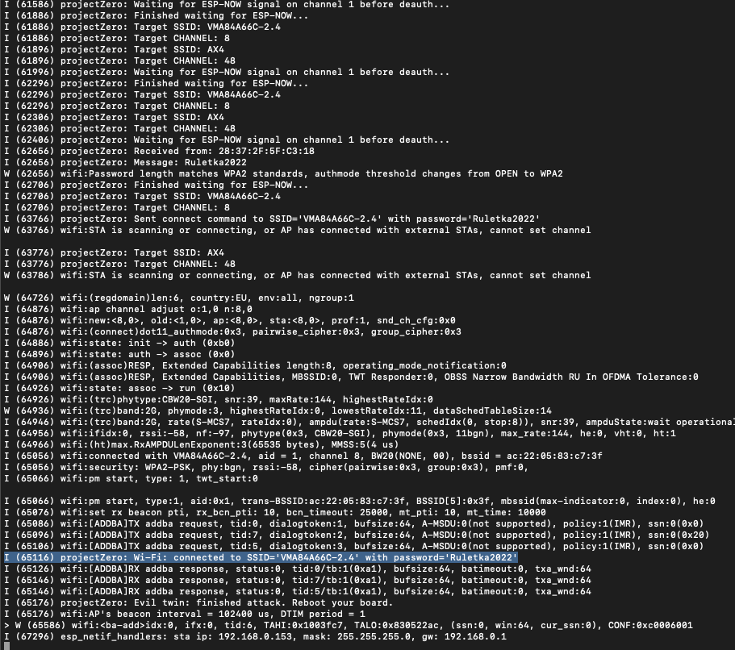

# Goal
2-board evil twin. ESP32C5 &amp; ESP32. CLI and Flipper Zero. Captive portal and password verification.

# Features
Deauthenticates more than one network, including 5GHz on very high channels. Uses PH country code. 

Passes twin network name to ESP32 over ESP-NOW. Sets uo portal and collected password is passed back to C5 for verification. 

If verification is succesfull, deauth attack is stopped.

# Usage
CLI supports up/down arrows and TAB autocompletion. 
Typical usage would be:
scan_networks
select_networks 1 4
start_evil_twin

Please note order of selected networks is important. While all of them will be deauth'ed, the first one will additionally give name to an evil twin.

# Screenshots

On iPhone, Twin network should look like below. Note an invisible character has been added to network name to avoid grouping.

In CLI mode, successful attack should look like below. Note deauth stops as soon as password is verified.

# Deployment to boards
It's all about MACs! C5 needs to know ESP32 mac and vice versa. At the moment you need to modify it straight in the code.

