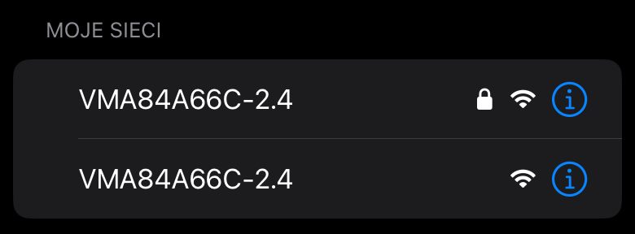
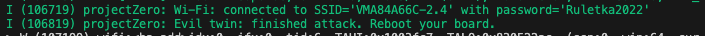
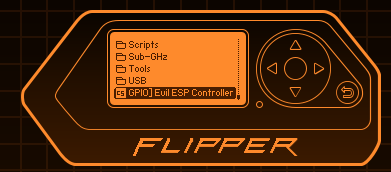
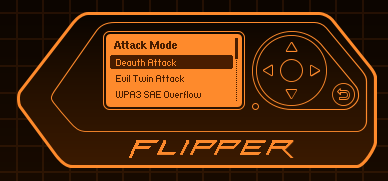
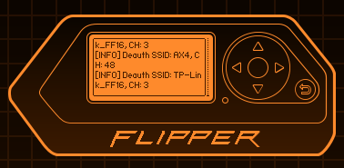

# Goal
This project is an 2-board evil twin mixed with deauther and SAE-Overflow WPA3 attack. It's based on:
- ESP32C5 (main CLI steering, deauth and password verification)
- ESP32 (evil twin captive portal)

It provides CLI and a Flipper Zero app running captive portal and password verification.

# Features
Deauthenticates more than one network, including 5GHz on very high channels. Uses PH country code. 

Passes twin network name to ESP32 over ESP-NOW. Sets up portal and collected password is passed back to C5 for verification. 

If verification is succesfull, deauth attack is stopped.

Flipper app - screens below. 

New feature - WPA3 SAE Overflow attack. Floods exactly one router with SAE Commit Frames.

# Usage
CLI supports up/down arrows and TAB autocompletion. 
Typical usage would be:
scan_networks
select_networks 1 4
start_evil_twin
sae_overflow

Please note order of selected networks is important. While all of them will be deauth'ed, the first one will additionally give name to an evil twin.

# Screenshots

On iPhone, Twin network should look like below. Note an invisible character has been added to network name to avoid grouping.

In CLI mode, successful attack should look like below. Note deauth stops as soon as password is verified.

# WPA3 SAE Overflow Attack

Sends multiple SAE Commit frames with random MAC to a router. This does not affect existing connections, but stops new ones from being established - see connection failed below: 

Important: select exactly one target before running this attack.

Wireshark reveals that AP responds it cannot handle so many stations:

# Deployment to boards
For Evil Twin - it's all about MACs! C5 needs to know ESP32 mac and vice versa. At the moment you need to modify it straight in the code.

All other attacks require just one board and you don't need to worry about it.

## Initial deployment to ESP32
Use ArduinoIDE and open EvilTwin_slave.ino file.

Side note: When uploading code to ESP32C3 (or S3) remember to set USB CDC On Boot to Enabled - otherwise you will not see any serial:

Next, after starting up it will print it's MAC in Serial Monitor:

Note it down. 

## Initial deployment to ESP32-C5
Use ESP-IDF. Open Folder ESP32C5 and then click Open:

 

Next, build, flash and monitor:

After it starts, grab the MAC address of C5 from the logs:

## MAC code updates
Now, in Arduino enter C5 MAC address (in hex form of byte array):

Next, in ESP-IDF in main.c on top enter ESP32 MAC address:

# Now recompile and flash both boards again.
They should become aware of each other and able to communicate over ESP-NOW.

# Flipper app

Run the app:

Run scan:

After clickling 'back' twice, go to Targets and select your target networks (the first one becomes evil twin):

Confirm your selection:

Select Deauth or Evil Twin if you have ESP32:

This is how running deauth looks like:

And this is how flipper presents password obtained from Evil Twin portal:

