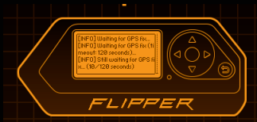

# Goal

This project is an 2-board evil twin mixed with deauther, SAE-Overflow WPA3 attack and Wardriving. 

It's based on:
- ESP32C5 (main CLI steering, deauth and password verification)
- ESP32 (optional, needed only for evil twin captive portal)

It provides CLI and a Flipper Zero app running captive portal and password verification.

# Features

## Deauthentication attack

Deauthenticates more than one network, including 5GHz on very high channels. Uses PH country code.

## Evil Twin
On top of deauthentication, it offers an evil twin. Another ESP32 sets up a fake network having the same name as the original one where captive portal asks for password.

ESP32C5 passes twin network name to ESP32 over ESP-NOW. Collected password is passed back to C5 for verification. 
If verification is succesfull, deauth attack is stopped.

On iPhone, Twin network should look like below. Note an invisible character has been added to network name to avoid grouping.

In CLI mode, successful attack should look like below. Note deauth stops as soon as password is verified.

## WPA3 SAE Overflow attack. 
It floods exactly one router with SAE Commit Frames. Router cannot accept so many random MACs and fails to accept any new legitimate connections. 

Sends multiple SAE Commit frames with random MAC to a router. This does not affect existing connections, but stops new ones from being established - see connection failed below: 

Important: select exactly one target before running this attack.

Wireshark reveals that AP responds it cannot handle so many stations:

## Wardriving

Creates files in Wigle.net format on SD card attached to the C5 board. Waits for gpx fix prior to actual wardriving.

# CLI Usage
Board, when connected to USB, offers CLI interface. 
CLI supports up/down arrows and TAB autocompletion. 
Typical usage would be:
scan_networks
select_networks 1 4
start_evil_twin
sae_overflow

Please note order of selected networks is important. While all of them will be deauth'ed, the first one will additionally give name to an evil twin.

# Flipper application screens and user journey
Run the app:

After running the app, connect the board when you see the splash screen.

Run scan:

After clicking 'back' twice, go to Targets and select your target networks (the first one becomes evil twin). Even though 'Confirm targets' gets selected after every click on each network, you can pres 'Up' button and select more networks.

After selecting network (remember: you can select more than one) you need to confirm your selection:

Once selection is confirmed, select Deauth (or Evil Twin if you have paired additional ESP32):

This is how running deauth looks like:

And this is how flipper presents password obtained from Evil Twin portal:

Wardrive attack produces files in Wigle.net format and waits for GPS fix before starting:

SAE Overflow attacks only one selected network. Remember, you should have confirmed exactly one selected target:

# Deployment to boards
For Evil Twin - it's all about MACs! C5 needs to know ESP32 mac and vice versa. At the moment you need to modify it straight in the code.

All other attacks require just one board and you don't need to worry about it.

## Initial deployment to ESP32
Use ArduinoIDE and open EvilTwin_slave.ino file.

Side note: When uploading code to ESP32C3 (or S3) remember to set USB CDC On Boot to Enabled - otherwise you will not see any serial:

Next, after starting up it will print it's MAC in Serial Monitor:

Note it down. 

## Initial deployment to ESP32-C5
Use ESP-IDF. Open Folder ESP32C5 and then click Open:

 

Next, build, flash and monitor:

After it starts, grab the MAC address of C5 from the logs:

## MAC code updates
Now, in Arduino enter C5 MAC address (in hex form of byte array):

Next, in ESP-IDF in main.c on top enter ESP32 MAC address:

# Now recompile and flash both boards again.
They should become aware of each other and able to communicate over ESP-NOW.

